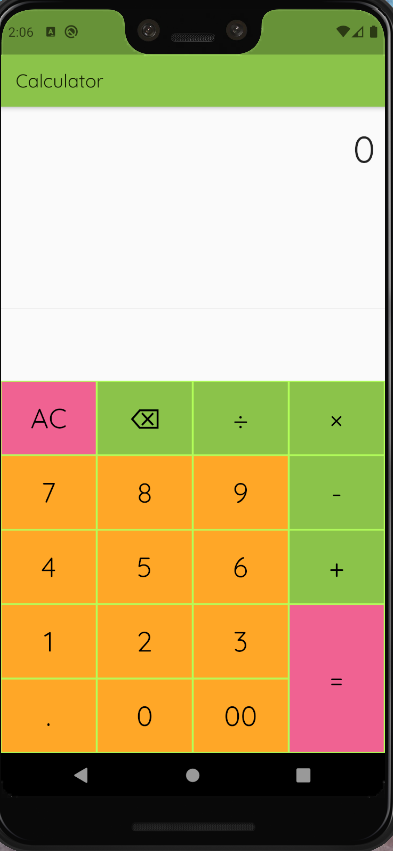
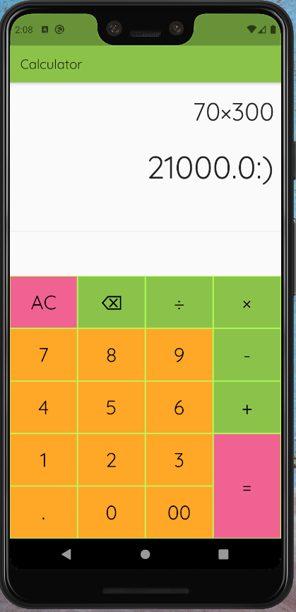
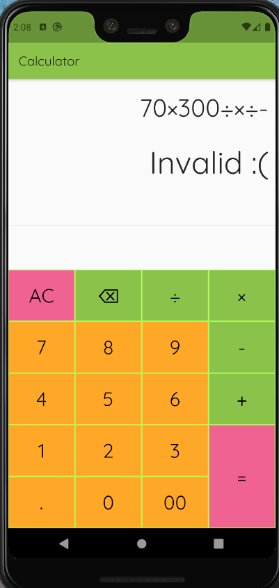

# calculator
#flutter
#flutterbeginner

A new Flutter project.

  

## Getting Started

This project is a starting point for a Flutter application.

A few resources to get you started if this is your first Flutter project:

- [Lab: Write your first Flutter app](https://flutter.dev/docs/get-started/codelab)
- [Cookbook: Useful Flutter samples](https://flutter.dev/docs/cookbook)

For help getting started with Flutter, view our
[online documentation](https://flutter.dev/docs), which offers tutorials,
samples, guidance on mobile development, and a full API reference.

This is the project based on a beautiful package of flutter i.e math_expressions [Here is It](https://pub.dev/packages/math_expressionss), which offers tutorials...

<h1 style="color:blue;text-align:center;">Thank You :)</h1>
